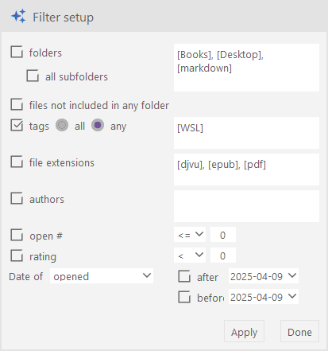

# Fileo

This application is about the files, your files.

Fileo[fɑɪlɔ] - could be FileOrganizer, but that doesn't matter.

The graphical interface is shown in the image below.

## The GUI elements:

1. shows application mode
2. menu button to hide/show the left pane widgets: folders, tags, file extensions, authors
3. shows the name of current file
4. menu button to select which fields will be visible in the file list (12)
5. shows the name of the current database
6. status bar
7. the left toolbar, it contains the following buttons from top to bottom:
   1. button to chose the data base
   2. selection of the "DIR" mode of application, the file list (12) shows the files from the current folder
   3. selection of the "FILTER" mode, the list of files (12) shows the files according to the filter settings
   4. open the filter settings dialog (14), switch application into "FILTER_SETUP" mode
   5. open dialog to scan the file system to load files into the database
   6. hide/show left pane
   7. menu button   &mdash;   do nothing yet
8. the folder tree widget
9. the tag list widget
10. the file extension list widget
11. the author list widget
12. the file list
13. the comments to the current file
14. the filter setup dialog
15. the list of tags, applied to the current file

The application works in three main modes: DIR, FILTER and FILTER_SETUP. In DIR mode, files are selected by the current directory in the "Folders" widget.

It the FILTER mode, the list of files depends on the parameters of the filter set in FILTER_SETUP mode.

## How it's done

As said, the app is about files. Files have a number of attributes:

1. name
2. path, the user will almost never see it, only by opening a directory or copying the full filename
3. extension
4. tags
5. rating
6. author(s) - usually for books
7. dates
   1. modified
   2. opened
   3. created
   4. published (books)
8. rating
9. how many times the file has been opened
10. size
11. pages - usually for books

The following attributes are used in filter: all dates (but only one can be used at a time), extension, tags, rating, authors, and folder which was intentionally not included in the file attributes.

Folders are not associated with file system directories, the path is used for that. You can freely create, move, copy and delete folders in the folder tree, the files will remain intact. You can, for example, create multiple folder hierarchies, this can be handy. Of course, if you delete all folders it will be impossible to access files using folder tree, but they remain accessible by filter. The next time the **`@@Lost`** folder will appear, it can be used to access files that are not in any other folder.
You can also copy/move files from one folder to another. **Copying** is carried out by dragging *with the left mouse button pressed*, **moving** - *with the left mouse button and Shift key pressed*.

## How it works

### How to add files?

There are two method to add files:

1. Open "Search for files..." dialog with the button 

   

2. drag files from the file explorer (or similar application) to the folder in the folder tree.

> **Note**. Scanning the file system can be quite lengthy, so it is performed in a separate thread.
> The red circle in the lower left corner is a sign that the thread is working:
>
> 
>
> Only one thread can run at time. The user interface is not blocking but you should avoid to perform operation that make changes in the database, for example, drag-drop operations. But you can change the list of files by changing a current folder or filter, or you can open files.

3. You can export the selected files (with all their attributes) from one database using the file list context menu

   

   and then import them to another database

   

   to the folder "New folder" in this case.

### How to work with filters

Firstly you should setup the filter:

With filter defined on the picture the file list will include files from folders `DB`, `ML` and `Rust`, that has at least one of tags `Math`, `ML` or `package`, has rating greater than 4, and opened after `2022-09-14`.

> **Note** Here "after" and "before" include the date in the input fields 2022-09-14 and 2022-11-14. That is, if "after"and "before" are equal then the filter includes files with a date equal to this date.

The Apply button applies a specified filter without closing the Filter Setup dialog box.

The button Done applies a filter, closing dialog and switch application into "Filter mode". In this mode when you change selection in one of the widgets in the left pane (Folders, Tags, Extensions, Authors) the list of files is changing accordingly.

### How to make comments to file

1. the file list
2. tags of the current file, this input field allows to add/remove tags. The double click in this field opens list of registered tags, you can select tags from this list (press Ctrl to select multiple tags).
3. comments widget, in the picture there are two comments to the current file, sorted in last "modified" date order.
4. "File info" widget to show the information about the current file. You can edit the following fields in this widget: rating of file, number of pages and authors.
   Authors can be added/selected in the combobox "Author selection" or deleted in the field "Author()(book)".
5. "+"  plus button - add comment
6. "*i*" button - show "File info" widget (4)
7. delete comment button
8. edit comment button

Comment is a markdown text.
